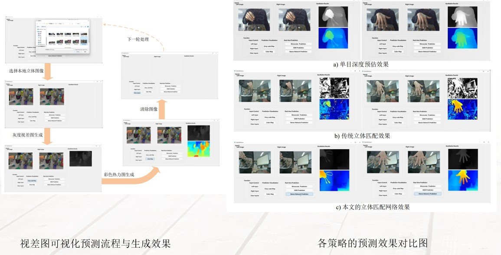
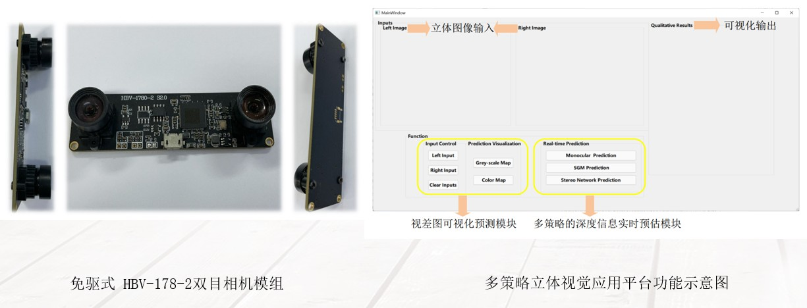

# Monocular and Stereo Depth Estimation Tools

This is a complete depth prediction project with front-end QT pages and back-end algorithms to test monocular depth prediction, SGM-based and deep learning-based binocular stereo matching algorithms.


**Work Flow
<div align=center></div>


## 🕹️ Getting Started

**Install the packages with Python 3.8 by: 

```shell
pip install -r requirements.txt
```

You need to download the [pre-trained weights](https://github.com/intel-isl/DPT/releases/download/1_0/dpt_hybrid-midas-501f0c75.pt) for dpt and put them in ```dpt\weights``` folder to start the monocular depth prediction algorithm.

You need to have access to a binocular camera in your local computer to use the stereo matching algorithm. 


**Hardware and Functions:
<div align=center></div>

You can use the functions in the left part to choose local files and predition the depth maps with grey-scale or color-scale.

You can use the functions in the right part to enable real-time depth prediction with monocular or stereo cameras, our experiments are evaluated NVIDIA RTX 2060.


## ⭐ Ciatation
This project is part of our follow-up research, if you find it helpful, please consider giving us a STAR⭐ and citing it.


```bibtex
@article{li2023bridging,
  title={Bridging stereo geometry and BEV representation with reliable mutual interaction for semantic scene completion},
  author={Li, Bohan and Sun, Yasheng and Liang, Zhujin and Du, Dalong and Zhang, Zhuanghui and Wang, Xiaofeng and Wang, Yunnan and Jin, Xin and Zeng, Wenjun},
  journal={arXiv preprint arXiv:2303.13959},
  year={2023}
}
```

## ⚖️ License

All content in this repository are under the [Apache-2.0 license](https://www.apache.org/licenses/LICENSE-2.0).